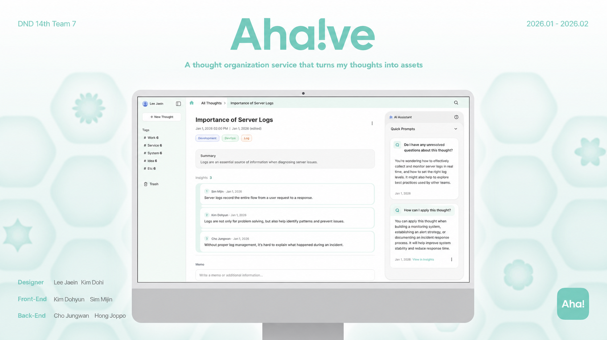

# Aha!ve

> An AI-powered insight management service that turns scattered thoughts into actionable insights.



## Overview

Aha!ve helps you turn short notes from your day-to-day work into structured insights with AI. Write a quick note, and Aha!ve generates an insight draft with a title, key takeaway, tags, and follow-up questions. You can revisit generated insight pieces, retry candidates, and expand your thinking through Q&A.

## Features

- **AI insight generation**: Automatically generates titles, key insights, tags, and questions from short notes.
- **Insight piece management**: Review generated insight pieces and retry for better candidates.
- **Q&A expansion**: Deepen your thinking by answering follow-up questions for each insight.
- **Tag-based exploration**: Organize and browse insights by generated tags.
- **Dashboard tab UX**: Open and switch between multiple insights using dashboard tabs.
- **Supabase auth and data integration**: Manages user authentication and insight data with Supabase.

## Tech Stack

| Area | Technology |
| --- | --- |
| Framework | Next.js 16, React 19, TypeScript |
| Styling | Tailwind CSS 4, shadcn/ui, Radix UI, Base UI |
| Server / DB | Supabase, Supabase SSR |
| State / Data Fetching | TanStack Query |
| AI | OpenAI Chat Completions API |
| Tooling | pnpm, Biome, Storybook |

## Getting Started

### 1. Install dependencies

```bash
pnpm install
```

### 2. Configure environment variables

Create a `.env.local` file in the project root and set the following values:

```env
NEXT_PUBLIC_SUPABASE_URL=
NEXT_PUBLIC_SUPABASE_ANON_KEY=
SUPABASE_SERVICE_ROLE_KEY=
OPENAI_API_KEY=
OPENAI_MODEL=gpt-4o-mini
```

### 3. Start the development server

```bash
pnpm dev
```

Open [http://localhost:3000](http://localhost:3000) in your browser.

## Scripts

```bash
pnpm dev              # Start the development server
pnpm build            # Build for production
pnpm start            # Start the production server
pnpm lint             # Run Biome checks
pnpm format           # Run Biome and apply formatting
pnpm storybook        # Start Storybook
pnpm build-storybook  # Build Storybook
```

## Project Structure

```txt
app/             Next.js App Router pages and API routes
components/      Shared UI and domain components
hooks/           Custom hooks
lib/             Supabase, query, AI, and utility logic
public/          Static assets and demo images
```

## Contributing

This project is not currently accepting external contributions. See [CONTRIBUTING.md](./CONTRIBUTING.md) for details.

## License

Copyright (c) 2026 Ahaive. All rights reserved. See [LICENSE](./LICENSE) for details.
