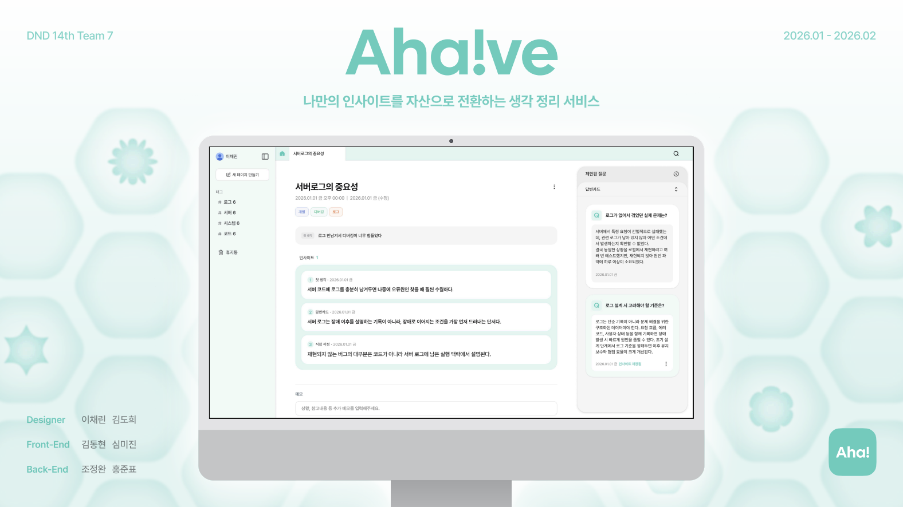

# Aha!ve

> 흩어진 생각을 실행 가능한 인사이트로 바꾸는 AI 기반 인사이트 관리 서비스

[English](./README.en.md)



## 소개

Aha!ve는 업무 중 떠오른 짧은 메모를 AI가 인사이트, 태그, 후속 질문으로 정리해주는 서비스입니다. 사용자는 한 줄 메모만 입력하면 인사이트 초안을 생성하고, 생성된 조각을 다시 시도하거나 질문을 통해 생각을 더 깊게 확장할 수 있습니다.

## 주요 기능

- **AI 인사이트 생성**: 메모를 기반으로 제목, 핵심 인사이트, 태그, 질문을 자동 생성합니다.
- **인사이트 조각 관리**: 생성된 인사이트 조각을 확인하고 더 나은 후보로 재생성할 수 있습니다.
- **Q&A 확장**: 인사이트별 질문을 통해 생각을 구조화하고 추가 답변을 남길 수 있습니다.
- **태그 기반 탐색**: 생성된 태그로 인사이트를 분류하고 모아볼 수 있습니다.
- **대시보드 탭 UX**: 여러 인사이트를 탭 형태로 열고 전환할 수 있습니다.
- **Supabase 인증/데이터 연동**: 사용자 인증과 인사이트 데이터를 Supabase로 관리합니다.

## 기술 스택

| 영역 | 기술 |
| --- | --- |
| Framework | Next.js 16, React 19, TypeScript |
| Styling | Tailwind CSS 4, shadcn/ui, Radix UI, Base UI |
| Server / DB | Supabase, Supabase SSR |
| State / Data Fetching | TanStack Query |
| AI | OpenAI Chat Completions API |
| Tooling | pnpm, Biome, Storybook |

## 시작하기

### 1. 의존성 설치

```bash
pnpm install
```

### 2. 환경 변수 설정

프로젝트 루트에 `.env.local` 파일을 만들고 아래 값을 설정합니다.

```env
NEXT_PUBLIC_SUPABASE_URL=
NEXT_PUBLIC_SUPABASE_ANON_KEY=
SUPABASE_SERVICE_ROLE_KEY=
OPENAI_API_KEY=
OPENAI_MODEL=gpt-4o-mini
```

### 3. 개발 서버 실행

```bash
pnpm dev
```

브라우저에서 [http://localhost:3000](http://localhost:3000)을 열어 확인합니다.

## 스크립트

```bash
pnpm dev              # 개발 서버 실행
pnpm build            # 프로덕션 빌드
pnpm start            # 프로덕션 서버 실행
pnpm lint             # Biome 검사
pnpm format           # Biome 포맷 적용
pnpm storybook        # Storybook 실행
pnpm build-storybook  # Storybook 빌드
```

## 프로젝트 구조

```txt
app/             Next.js App Router 페이지 및 API Route
components/      공통 UI와 도메인 컴포넌트
hooks/           커스텀 훅
lib/             Supabase, Query, AI, 유틸 로직
public/          정적 이미지 및 데모 이미지
```

## 기여

현재 이 프로젝트는 외부 기여를 받고 있지 않습니다. 자세한 내용은 [CONTRIBUTING.md](./CONTRIBUTING.md)를 참고해주세요.

## 라이선스

Copyright (c) 2026 Ahaive. All rights reserved. 자세한 내용은 [LICENSE](./LICENSE)를 참고해주세요.
